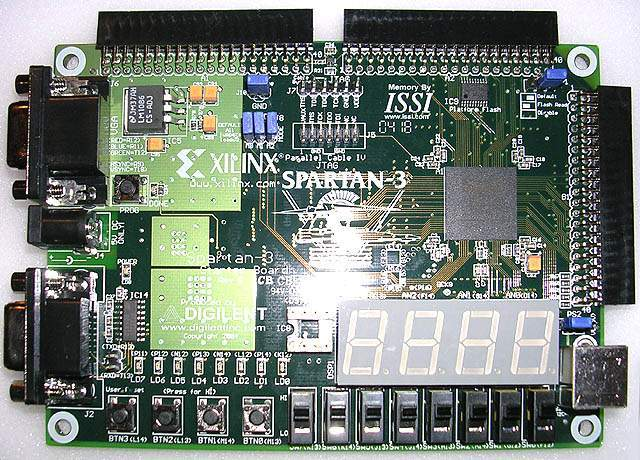

# Report of Stopwatch Design

## 1. Team and Contribution

This project is done all by myself. My student ID is 3100000172, my name is 楼洵. All code is 100% written by myself, except some modules from the logic experiments course.

## 2. User Manual



This project uses these for input:

1. Pushbuttons
    - L14: Start / Stop
    - L13: Pause / Resume
    - M14: Record / Recall
    - M13: Recall Mode: when pushing will show register record indexed using H13~F12
2. Switchs:
    - K13: Display Mode: if 0 display minute and second, if 1 display second and percent second
    - H13~F12: Register Address: select record index

and these for output:

1. Seven Seg: for time
2. LEDs:
    - P11: on when started
    - P12: on when paused
    - N12: on when writing to registers
    - P13: on when using recall_mode1

For a demo session please see [here](http://youtu.be/HIr7EuJo39I)

## 3. Model Design

In this project, the top module is called `calc` (mainly because I've copied some useful modules from the previous logic experiments)

calc.v

```
`timescale 1ns / 1ps
module calc(
// clock
	input wire clk,
// pushbuttons
	input wire start_in, pause_in,
	input wire record_in, recall_mode_in,
// switchs
	input wire display_mode, // 0 is min/sec
	input wire[3:0] reg_address,
// seven seg
	output wire[3:0] anode,
	output wire[7:0] segment,
// LEDs
	output wire started_LED,
	output wire paused_LED,
	output wire write_LED,
	output wire mode_LED);

	// wire seven seg
	reg[15:0] display_num;
	initial begin
		display_num = 16'b0;
	end
	display_16 seven_seg(clk, display_num, anode[3:0], segment[7:0]);

	// debounce push buttons
	wire start_stop, pause_resume, record_recall, recall_mode;
	pbdebounce p0(clk, start_in, start_stop);
	pbdebounce p1(clk, pause_in, pause_resume);
	pbdebounce p2(clk, record_in, record_recall);
	pbdebounce p3(clk, recall_mode_in, recall_mode);

	// the stopwatch
	wire[23:0] result;
	wire reg_exceed;
	stop_watch sw(clk,
		start_stop, pause_resume,
		record_recall, recall_mode,
		reg_address,
		reg_exceed,
		started_LED, paused_LED,
		write_LED, mode_LED,
		result);

	// choose display
	always @* begin
		if (reg_exceed)
			display_num = 16'hEFFD; // F will display "r", D will display "."
		else
			case(display_mode)
				1'b0: display_num = result[23:8];
				1'b1: display_num = result[15:0];
			endcase
	end

endmodule
```

The top module does no real functional things but just wiring various things up, debouncing pushbuttons, and choose display according to `display_mode`.

In the `reg_exceed` case, I've used some trick: change the `display_16` module's display of `F` and `D` to archive the effect of an output of "Err." since in fact only 0~9 are possible values in normal case.

The stopwatch function are implemented in the `stop_watch` module.

stop_watch

```
`timescale 1ns / 1ps
module stop_watch(
	input wire clk,
	input wire start_stop, pause_resume,
	input wire record_recall, recall_mode,
	input wire[3:0] reg_address,
	output wire reg_exceed,
	output reg started, paused,
	output wire write, rmode,
	output wire[23:0] result);

	reg[3:0] rec_pos, dis_pos;

	initial begin
		started = 0;
		paused = 0;
		rec_pos = 0;
		dis_pos = 0;
	end

	// stopwatch control
	reg reset;

	always @(posedge start_stop) started <= ~started;
	always @(posedge pause_resume) paused <= ~paused;
	always @(negedge record_recall) begin
		if (started) begin
			rec_pos <= rec_pos + 1;
			dis_pos <= dis_pos + 1;
		end
		else
			if (dis_pos == rec_pos)
				dis_pos <= 0;
			else
				dis_pos <= dis_pos + 1;
	end
	always @(posedge clk) begin
		if (reset) reset <= 0;
		else if (~started & start_stop) reset <= 1;
	end

	// timer
	wire clk_psec, clock_psec;
	timer_1ps psec_clock(clk, clk_psec);
	assign clock_psec = started & (~paused) & clk_psec;
	wire[3:0] sec_low, sec_high, min_low, min_high, psec_low, psec_high;
	sw_gen_psec PSEC(clock_psec, reset, clk_sec, psec_low, psec_high);
	sw_gen_sec SEC(clk_sec, reset, clk_min, sec_low, sec_high);
	sw_gen_min MIN(clk_min, reset, min_low, min_high);
	wire[23:0] timer_result;
	assign timer_result[23:20] = min_high[3:0] ;
	assign timer_result[19:16] = min_low[3:0] ;
	assign timer_result[15:12] = sec_high[3:0] ;
	assign timer_result[11:8]  = sec_low[3:0] ;
	assign timer_result[7:4]   = psec_high[3:0];
	assign timer_result[3:0]   = psec_low[3:0];

	// registers
	wire[3:0] address;
	assign reg_exceed = recall_mode & (reg_address > rec_pos);
	assign address = (started) ? rec_pos : ((recall_mode) ? reg_address : dis_pos);
	wire[23:0] reg_out;
	assign write = (started & record_recall) | start_stop;
	regfile registers(write, (~started & clk), address, timer_result, reg_out);

	// wire output
	assign result = (started) ? timer_result : reg_out;
	assign rmode = recall_mode;

endmodule
```

Here, `rec_pos` is used when writing data into registers, `dis_pos` is used when using recall_mode0, thus each click of the M14 pushbutton will increase `dis_pos` to display records one by one.

This module also contains a `reset` variable, it is used to reset all timer to zero, when you click L14 to start the stopwatch from a stopped state.

The timer part does some interesting things:

- First, use the `timer_1ps` module to downgrade the original 50MHz clock to only 1 posedge in 1/100 second;
- Second, do some logic combination to include `started` and `paused` to get the final `clock_psec`;
- Third, wire this final clock into the `sw_gen_psec` module, this module will save the percent second info, and trigger posedge when exceeded;
- Then, wire `clk_sec` and `clk_min` accordingly to `sw_gen_sec` and `sw_gen_min` to get the second and minute info;
- Finally, combine all the output from the generation modules and get the final `timer_result`.

_Note: I got the idea of `timer_1ps` from the `timer_1ms` module used in `pbdebounce`._

Listing these module's codes.

timer_1ps

```
`timescale 1ns / 1ps
module timer_1ps(
	input wire clk,
	output reg clk_1ps);

	reg[18:0] cnt;
	initial begin
		cnt[18:0] <= 0;
		clk_1ps <= 0;
	end

	always @(posedge clk)
		if (cnt >= 250000) begin
			cnt <= 0;
			clk_1ps <= ~clk_1ps;
		end
		else begin
			cnt <= cnt+1;
		end

endmodule
```

sw_gen_psec

```
`timescale 1ns / 1ps
module sw_gen_psec(
	input wire clk_psec,
	input wire reset,
	output reg clk_sec,
	output reg[3:0] psec_low, psec_high);

	initial begin
		psec_low = 0;
		psec_high = 0;
	end

	always @(posedge clk_psec or posedge reset) begin
		if (reset) begin
			psec_low = 0;
			psec_high = 0;
		end
		else
			if (psec_low == 9) begin
				psec_low = 0;
				clk_sec = 0;
				if (psec_high == 9) begin
					psec_high = 0; // grow second
					clk_sec = 1;
				end
				else
					psec_high = psec_high + 1;
				end
			else
				psec_low = psec_low + 1;
	end

endmodule
```

the `sw_gen_sec` and `sw_gen_min` modules are very similar to `sw_gen_psec`, no repeat here.

## 4. Simulation

Sorry I've no time for the simulation part... I've used the 'compile and run' method to solve many problems encountered in the `stop_watch` module's `stopwatch control` part.

The hardest (and final) one is when writing to registers, it seemed to be writing to both the current address (which is correct) and the increased address, after several tries I came to the conclusion that it's because I've increased the address at the posedge of `record_recall`, I think this problem should be clear if I've done simulation.

But I just changed that line into `always @(negedge record_recall) begin` and re-compile and in fact got the problem solved.

## 5. HDL Synthesis

see the files in `synthesis` folder.

## 6. Conclusion

I've done this project in proximately 5 hours in 3 days. With a good start from the expierences learned in the logic experiments, I have a rough overall design from the very beginning.

Most problems I've encoutered happened when trying to figure out how to write the `stopwatch control` part of the `stop_watch` module, the biggest one is how to do a correct reset when starting from a stopped state. I've got the final version after many times of redesign...

The only remaining problem of this project is it cannot reset the registers and `rec_pos`, `dis_pos` when starting from a stopped state. Because I really couldn't figure out where (and how) to reset these values...

For improvements, I think the `regfile` module could be written in a more clean style, without using the `decoder_4_16` and `mux_16_1` module.

As for conclusion, I think I've done a good amout of work, the stopwatch's main functionalities are usable and stable. And I've solved some annoying problems along the way.
